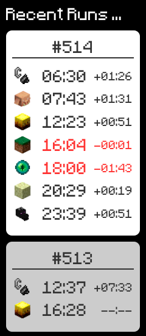

# Minecraft Speedrun IGT Timeline Widget

## About

このツールはマインクラフトのエンドラ RTA の IGT タイムラインをリアルタイムに表示するウィジェットツールです。
動画配信において、画面上に表示し、視聴者にランの状況を理解しやすくすることを主な目的としています。

利用できるコンポーネントは、主に以下の３つです。

- 現在のラン(Current Run)のタイムライン
- 最近のラン(Recent Runs)のタイムライン
- 自己ベスト(Personal Best)のタイムライン

|              現在のラン(Current Run)               |              最近のラン(Recent Runs)               |              自己ベスト(Personal Best)               |
| :------------------------------------------------: | :------------------------------------------------: | :--------------------------------------------------: |
|  |  |  |

各要素の色や、文字のフォント、ラベルの文字列、並び順等はカスタマイズ可能です。

## How to use

### 前提・事前準備

1. ダウンロードと解凍

   [リリースページ](https://github.com/mcrtabot/mcsr-widget/releases)からファイルをダウンロードし、適当な場所に解凍します。

2. Docker, Docker Compose (docker-compose) のインストール

   本ツール は Docker コンテナ上で実行されるため、Docker が必要になります。
   (仮想マシンを実行して、その上でソフトを動かしているイメージですが、特に理解する必要はありません。)

   Docker は以下のリンク先からダウンロードしてインストールしてください。
   Windows は必要に応じて WSL(Windows Subsystem for Linux) のインストールやアップグレードが必要になるかもしれません。

   - Windows の場合 https://docs.docker.jp/docker-for-windows/install.html
   - Mac の場合 https://matsuand.github.io/docs.docker.jp.onthefly/desktop/mac/install/

3. SpeedrunIGT (Minecraft Mod)の設定

   本ソフトを利用するためには、Minecraft の RTA Mod の SpeedrunIGT を利用している必要があります。
   利用していない場合は、[SpeedRunIGT (Mod) - マインクラフト RTA Wiki](https://minecraft-rta.playing.wiki/d/SpeedRunIGT%20%28Mod%29)を参考にインストールしてください。

   **「現在のラン」のタイムラインをリアルタイムで表示する場合**、マインクラフトの `設定...` → `SpeedrunIGTの設定(エンダーパールアイコン)` → `タイマー(Timer)` → `自動でページ切り替え間隔(Auto Save Interval)` を `ティック(Ticks)` に設定してください。

   ※ この設定によって、スペックの低いマシンでは、動作が重くなる可能性があるので、状況によっては設定を変更してください。

### 初期設定

4. `.env`ファイルを開き以下を設定します。

   1. `SPEEDRUNIGT_RECORDS_DIR_xx`

      「最近のラン」のタイムラインを表示するための設定です。利用しない場合は設定しなくて問題ありません。

      SpeedrunIGT が出力するレコードファイルの保存フォルダを指定します。1 つ以上指定されていれば、後は空で問題ありません。

      通常は Windows の場合は `${USERPROFILE}\speedrunigt\records`、Mac の場合は `${HOME}/speedrunigt/records`です。分からない場合は、マインクラフトの `設定...` → `SpeedrunIGTの設定(エンダーパールアイコン)` → `レコード(Records)` → `レコード ディレクトリを開く(Open Records Directory)` から調べられます。

   2. `MINECRAFT_SAVE_DIR_xx`

      **「現在のラン」のタイムラインをリアルタイムで表示するための設定**です。利用しない場合は設定しなくて問題ありません。

      インスタンスのセーブデータが保存されているディレクトリ(インスタンス内の`.minecraft/saves`)を指定します。マルチインスタンス構成の場合は、すべてのインスタンスのディレクトリを指定してください。

      分からない場合は、[ゲームディレクトリ（minecraft フォルダー）を開く - マインクラフト RTA Wiki](https://minecraft-rta.playing.wiki/d/%a5%b2%a1%bc%a5%e0%a5%c7%a5%a3%a5%ec%a5%af%a5%c8%a5%ea%a1%caminecraft%a5%d5%a5%a9%a5%eb%a5%c0%a1%bc%a1%cb%a4%f2%b3%ab%a4%af)を参考にして調べてください。

### 実行とカスタマイズ

5. 実行

   解凍したディレクトリ内にある実行用ファイルを実行します。

   - Windows の場合 `mcsr-igt-timeline-widget.bat`
   - Mac の場合 `mcsr-igt-timeline-widget.sh`

   問題なければ、http://127.0.0.1:1161 が開き、ウィジェットが表示されます。

6. 自己ベストデータの作成

   `setting/pb.json` を開き、各項目を`hh:mm`形式で入力します。
   タイムラインの項目については、[タイムライン項目](#タイムライン項目)を参照してください。

   自己ベストを出した時の各地点のタイムでもいいし、その地点までの今までの最速タイムでもいいし、自由に設定してください。

7. 見た目のカスタマイズ

   `setting/setting.json` を開き、項目をカスタマイズします。
   各設定項目については、設定ファイル内に記載されています。

   設定ファイルが認識されない場合は、JSON の構文チェックツール([JSON Pretty Linter Ver3](https://lab.syncer.jp/Tool/JSON-Viewer/))などを用いて、構文が間違っていないことを確認してください。（最後の項目の後にはカンマ`,`を入れてはいけないのが間違えやすいポイントです）

   ファイルを保存すると自動的にブラウザの見た目に反映されますが、もしされない場合は、ブラウザをリロードしてください。

   設定は複数作成、併用することができます。また、設定用にデモデータでページを開き、各パターンの表示を確認しながら設定することができます。

   | #          | 設定ファイル               | URL                               | 設定用デモ URL                           |
   | ---------- | -------------------------- | --------------------------------- | ---------------------------------------- |
   | デフォルト | `setting/setting.json`     | http://127.0.0.1:1161/            | http://127.0.0.1:1161/?demo=1            |
   | 1          | `setting/setting_1.json`   | http://127.0.0.1:1161/?widget=1   | http://127.0.0.1:1161/?widget=1&demo=1   |
   | 2          | `setting/setting_2.json`   | http://127.0.0.1:1161/?widget=2   | http://127.0.0.1:1161/?widget=2&demo=1   |
   | 3          | `setting/setting_3.json`   | http://127.0.0.1:1161/?widget=3   | http://127.0.0.1:1161/?widget=3&demo=1   |
   | :          | :                          | :                                 | :                                        |
   | n          | `setting/setting_{n}.json` | http://127.0.0.1:1161/?widget={n} | http://127.0.0.1:1161/?widget={n}&demo=1 |

### 終了

8. 終了

   バックグラウンドで実行中のツールを停止するためには解凍したディレクトリ内にある実行用ファイルを実行します。

   - Windows の場合 `mcsr-igt-timeline-widget-stop.bat`
   - Mac の場合 `mcsr-igt-timeline-widget-stop.sh`

## Appendix

### タイムライン項目

| name             | タイミング                               | 関連する進捗   |
| ---------------- | ---------------------------------------- | -------------- |
| enter_nether     | ネザーに入る                             | さらなる深みへ |
| enter_bastion    | 砦の遺跡に入る                           | 兵どもが夢の跡 |
| enter_fortress   | ネザー要塞に入る                         | 恐ろしい要塞   |
| nether_travel    | 新しいポータルからオーバーワールドに戻る | (なし)         |
| enter_stronghold | エンド要塞に入る                         | アイ・スパイ   |
| enter_end        | エンドに入る                             | おしまい？     |
| complete         | 出口ポータルに入り計測ストップ           | (なし)         |

### Minecraft フォント

初期設定は[Minecraft フォント](https://fontmeme.com/jfont/minecraft-font/)を利用する設定になっています。
なくても代替フォントが表示されるので問題ありませんが、マイクラの雰囲気に合わせられるのでオススメです！
